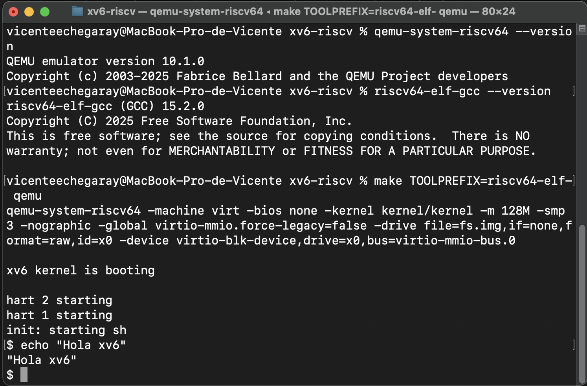

# INFORME — T0: Instalación y ejecución de xv6

## 1) Entorno
- macOS: 15.6.1 (24G90)
- Arquitectura: (Apple Silicon)
- Homebrew en PATH: (sí)
- Versiones:
  - QEMU: `qemu-system-riscv64 --version` → QEMU emulator version 10.1.0
  - Toolchain: `riscv64-elf-gcc --version` → riscv64-elf-gcc (GCC) 15.2.0

## 2) Pasos realizados
1. Instalé Xcode Command Line Tools: `xcode-select --install`
2. Instalé dependencias con Homebrew:
   - `brew install qemu riscv64-elf-gcc gawk gnu-sed coreutils`
3. Cloné el repo y compilé:
   - `git clone ... && cd ...`
   - `make clean`
   - `make TOOLPREFIX=riscv64-elf-`
4. Ejecuté xv6:
   - `make TOOLPREFIX=riscv64-elf- qemu` (salida con Ctrl-A, luego X)

## 3) Verificación
- Dentro de xv6 corrí:
  - `ls`
  - `echo "Hola xv6"`
  - `cat README`
- Resultado: El os responde de forma esperable a los comandos entregados desde terminal
- Captura: ver imagen abajo.

## 4) Problemas y soluciones
- Problema: no hubieron problemas durante la instalacion
- Solución: 
- Estado final: Listo

## 5) Captura

## 6) Conclusión
- xv6 compila y corre correctamente en mi Mac.  
- QEMU y toolchain reconocidos.  
- Lista la evidencia en la sección de verificación/captura.
